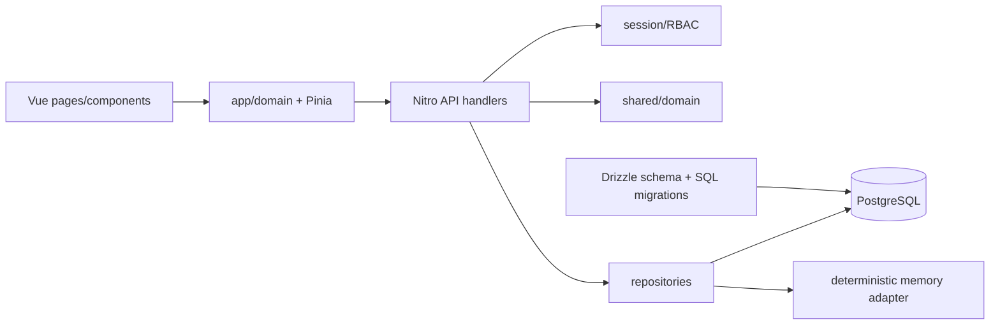
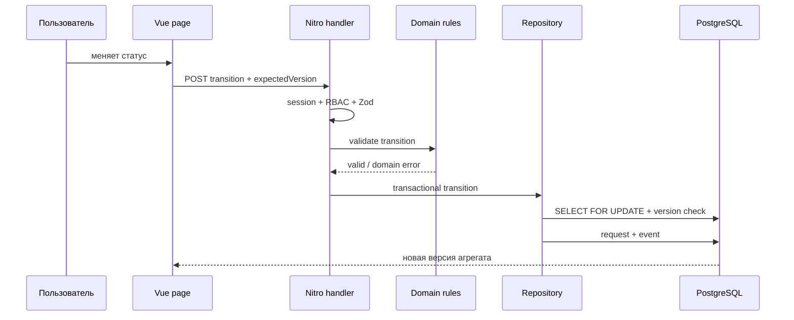

# Архитектура WorkFlow

WorkFlow — модульный монолит на Nuxt/Nitro. Один deployable упрощает транзакции и эксплуатацию, но бизнес-правила не зависят от Vue, HTTP или PostgreSQL и могут тестироваться отдельно.

## Границы

- `shared/types` — контракты API без привязки к среде выполнения.
- `shared/domain` — чистые правила переходов, видимости и optimistic locking. Здесь запрещены импорты Vue, Nitro и драйвера БД.
- `app/domain` — клиентские адаптеры DTO; страницы отвечают за композицию, компоненты — только за представление.
- `app/stores` — состояние с жизненным циклом дольше одной страницы: сессия, предпочтения и история отмены. Списки заявок остаются в `useAsyncData`, чтобы SSR был единственным источником начального состояния.
- `server/api` — HTTP-граница: валидация Zod, аутентификация, авторизация и преобразование ошибок в статусы.
- `server/repositories` — единственная точка доступа к постоянным данным. Репозиторий сохраняет атомарность операций и скрывает PostgreSQL/демо-адаптер от API.
- `server/services` — инфраструктурные сценарии, которые не относятся к HTTP, например жизненный цикл сессии.
- `server/database` и `drizzle` — схема и последовательные миграции.

Допустимое направление зависимостей: `pages → app/domain → shared`; `server/api → shared + repositories/services`; `repositories → database + shared`. Обратные импорты запрещены.

## Поток изменения заявки

## Решения

### ADR-001: модульный монолит

Статус: принято. Для текущего масштаба отдельные сервисы добавили бы распределённые транзакции и сложную локальную среду без полезной изоляции. Доменные границы оставляют возможность позже выделить уведомления или файлы.

### ADR-002: серверные cookie-сессии

Статус: принято. Браузер получает случайный токен в `HttpOnly`, `SameSite=Lax`, `Secure` production-cookie; БД хранит только SHA-256 хэш. Это уменьшает поверхность XSS по сравнению с токеном в localStorage и позволяет немедленно отзывать сессии.

### ADR-003: URL как состояние списка

Статус: принято. Фильтры, поиск, сортировка и страница находятся в query string. Ссылку можно переслать, SSR сразу возвращает правильную выборку, а Pinia не дублирует серверный кэш.

### ADR-004: PostgreSQL с детерминированным demo fallback

Статус: принято. В production `DATABASE_URL` обязателен. Локально без него тот же контракт репозитория использует изолированный набор данных, что ускоряет UI/E2E-цикл. Fallback явно обозначен как непостоянный и не предназначен для нескольких инстансов.

## Надёжность и наблюдаемость

- Изменения заявки используют `version` и возвращают 409 при потерянном обновлении.
- Смена статуса и запись события выполняются одной транзакцией; undo — новый проверяемый переход, а не удаление истории.
- API использует стабильные 401/403/404/409/422/429; интерфейс сохраняет пользовательский ввод и показывает повтор действия.
- `/api/health` на production-уровне служит readiness/liveness точкой; структурированные server logs остаются в stdout контейнера.

## Масштабирование

Nitro-инстансы не хранят сессии и рабочие данные в памяти при настроенной БД, поэтому масштабируются горизонтально. Статика и SWR-страницы могут обслуживаться CDN. Файлы вынесены за интерфейс вложений: локальный volume подходит для одного узла, а S3-совместимое хранилище можно подключить без изменения доменной модели.
